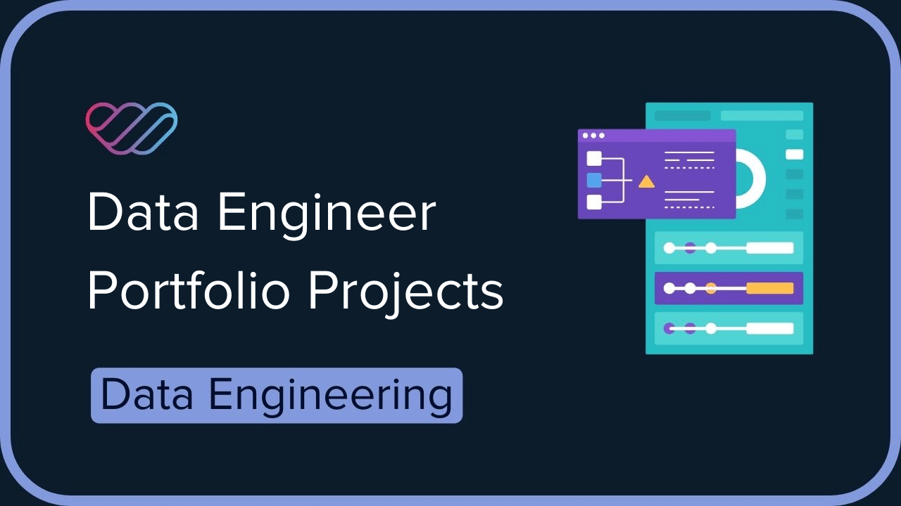

# data-engineering-portfolio
A collection of data engineering projects showcasing my skills in building robust, scalable, and secure data pipelines using modern tools and cloud platforms. 

This portfolio demonstrates experience across the full data engineering lifecycle — from data ingestion and transformation to orchestration, governance, and monitoring.

**Key Technologies**:
- Data Lake: *Google Cloud Storage*
- Data Warehouse: *Google BigQuery*
- IaC: *Terraform*
- Data Transformation: *dbt*, *PySpark*
- Workflow orchestration: *Kestra*, *Airflow*
- Containerization: *Docker*

## **Projects**
 
### [Github activities visualization](https://github.com/LolloPero/Github-activities-visualization)
   
#### description

ETL pipeline orchestrated with Kestra that extracts *.json* files data from [GH Archive](https://www.gharchive.org/), load them to a Google Cloud Bucket, transforms them into Tables in Google BigQuery via *dbt*. Data are visualized via *Looker Studio*

#### tech stack

- *Docker* (containerization)
- *Terraform* (infrastructure as code)
- *Kestra* (workflow orchestration)
- *Google Cloud Storage* (data lake)
- *BigQuery* (data warehouse)
- *dbt* (data transformation)
- *Looker Studio* (data visualization)

### [Crypto Timeseries](https://github.com/LolloPero/Data-Science-portfolio/tree/main/api_etl_database)

#### description

Simple ETL pipeline orchestrated with *AirFlow*. Reads data from from [CoinCap](https://pro.coincap.io) api and loads data into a *postresql* database using a *PySpark* cluster.

#### tech stack

- *AirFlow* (workflow orchestration)
- *PySpark* (data transformation)
- *Postgresql* (database)

### [Single Guide RNA pipeline](https://github.com/LolloPero/sgRNA)

#### description

This repository contains a *Nextflow* pipeline that takes a file of sgRNA sequences and analyzes where they align in the human genome (GRCh38). It includes steps to convert and compare gene information, and creates a simple gene expression matrix using data from two breast cancer (TCGA-BRCA) samples.

#### tech stack

- *Nextflow* (workflow orchestration)
- *Docker* (containerization)

